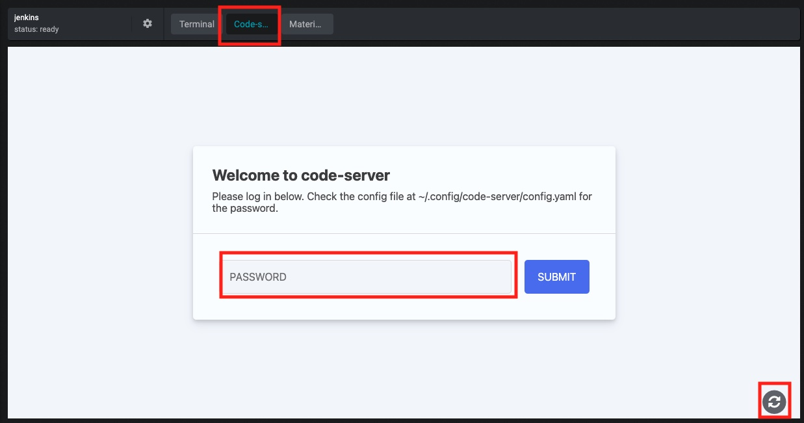
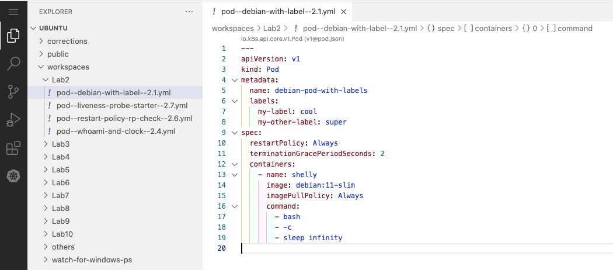

# Prerequisite

All the labs will be carried out using [`minikube`](https://minikube.sigs.k8s.io/).

In the labs, where the behavior differs between training environments, the commands will be prefixed with:

- "☁️ (cloud)" for Strigo
- "💻 (local)" for local use

## Training in Strigo

You have at your disposal in the Strigo Lab a _`kubernetes`_ machine with `docker`, `minikube`, `kubectl` and `helm` already installed with autocompletion.

You have access to a Visual Studio Code via the 'code' button of the Strigo Lab.
The password is available in the file `~/.config/code-server/config.yaml` and displayed when launching a terminal.

When the password is submitted successfully, all the files in the home directory can be edited.

## Training on local machine

In order to perform the labs locally, you need to install the following tools:

- `docker`: <https://docs.docker.com/engine/install/>
- `minikube`: <https://minikube.sigs.k8s.io/docs/start/> (installation steps only) (and autocompletion: `minikube completion --help`)
- `kubectl`: <https://kubernetes.io/docs/tasks/tools/#kubectl> (and autocompletion: `kubectl completion --help`)
- `helm` (TP 9): <https://helm.sh/docs/intro/install/> (and autocompletion: `helm completion --help`)

## Cheat sheet

A cheat sheet containing the usual Docker and Kubernetes commands is present at the end of the document.

